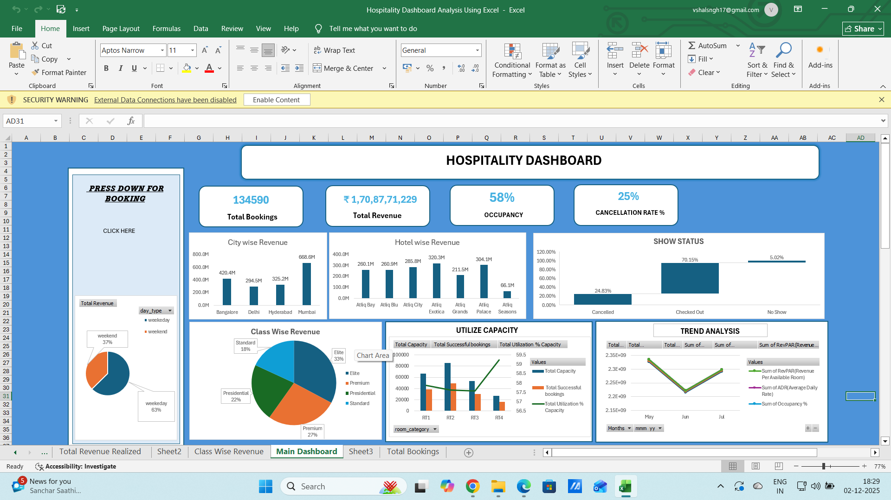
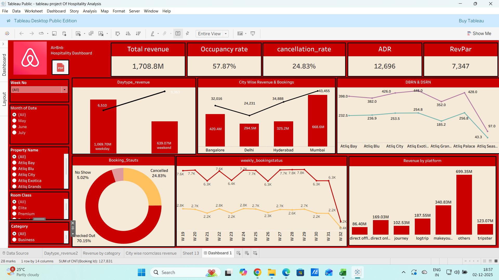

# Hospitality Revenue & Customer Experience Analytics Dashboard

# 📌 Project Overview

This project presents a comprehensive hospitality analytics dashboard designed to help hotel management teams monitor revenue performance, customer behavior, occupancy trends, and operational efficiency.

The dashboard transforms raw hospitality data into actionable business insights that support:

* Revenue optimization
* Occupancy management
* Customer retention strategies
* Operational decision-making
* Executive reporting

---

# 🎯 Business Problem

Hospitality businesses generate large volumes of booking and customer data but often struggle to:

* Track occupancy performance effectively
* Identify revenue leakage
* Analyze seasonal demand fluctuations
* Monitor customer satisfaction trends
* Improve booking conversion and retention

This project addresses these challenges through interactive analytics and KPI-driven reporting.

---

# 🚀 Project Objectives

The primary objectives of this dashboard are to:

✔ Monitor hotel revenue trends
✔ Analyze occupancy and booking behavior
✔ Track customer satisfaction KPIs
✔ Identify seasonal demand patterns
✔ Improve operational visibility
✔ Support data-driven pricing strategies

---

# 🛠 Tech Stack

| Tool     | Purpose                                                  |
| -------- | -------------------------------------------------------- |
| SQL      | Data Querying, KPI Analysis & Business Insights          |
| Tableau  | Interactive Dashboard Development & Data Visualization   |
| Power BI | Executive Dashboarding & Business Intelligence Reporting |
| Excel    | Data Cleaning, Validation & Initial Analysis             |


---

# 📊 Key Performance Indicators (KPIs)

| KPI                         | Description                     |
| --------------------------- | ------------------------------- |
| Total Revenue               | Overall revenue generated       |
| Occupancy Rate              | Room occupancy performance      |
| ADR                         | Average Daily Rate              |
| RevPAR                      | Revenue Per Available Room      |
| Cancellation Rate           | Booking cancellation percentage |
| Customer Satisfaction Score | Guest experience performance    |
| Repeat Customer %           | Loyalty & retention metric      |

---

# 📈 Dashboard Features

## 🏨 Revenue Analytics

* Monthly revenue trends
* Seasonal revenue comparison
* Revenue by hotel category
* Peak vs off-season analysis

---

## 👥 Customer Insights

* Guest demographics analysis
* Repeat customer tracking
* Booking behavior patterns
* Customer satisfaction trends

---

## 📅 Booking & Occupancy Analysis

* Occupancy performance tracking
* Booking cancellation analysis
* Room utilization insights
* Booking channel comparison

---

## 🎛 Interactive Dashboard Filters

* Hotel Branch
* Room Category
* Customer Type
* Booking Channel
* Season
* Date Range

---

# 🧠 Key Business Insights

📌 Peak-season bookings generated significantly higher revenue than off-season periods.

📌 Luxury room categories contributed the highest profit margins.

📌 Online booking platforms drove the majority of high-value customers.

📌 Cancellation rates increased substantially during holiday periods.

📌 Repeat customers showed higher average spending behavior.

---

# 💡 Business Recommendations

✔ Optimize dynamic pricing during high-demand seasons
✔ Strengthen loyalty programs for repeat guests
✔ Improve cancellation management strategies
✔ Increase focus on profitable booking channels
✔ Enhance customer experience initiatives

---

# 🖥 Dashboard Preview


[PowerBI_Dashboard](images/PowerBI_Dashboard_Screenshot.png)


---

# 🔄 Project Workflow

Raw Hospitality Dataset
            ↓
Data Cleaning & Validation
            ↓
SQL Querying & KPI Extraction
            ↓
Dashboard Development in Power BI
            ↓
Business Insights & Recommendations
```

---

# 📂 Repository Structure

```text id="wujc0o"
Hospitality-Revenue-Analytics-Dashboard/
│
├── data/
├── dashboard/
├── sql/
├── images/
├── README.md
└── hospitality-dashboard.pbix
```

---

# 🌟 Project Highlights

✅ Executive-Level Dashboard
✅ Real-World Hospitality Use Case
✅ Interactive KPI Reporting
✅ Revenue & Occupancy Analytics
✅ Customer Experience Insights
✅ Business Intelligence Storytelling

---

---

# 🏆 Project Value

This project demonstrates:

* Business Intelligence skills
* Dashboard storytelling
* KPI reporting
* Hospitality domain understanding
* Data-driven decision-making
* Executive reporting capabilities

---

# 📬 Connect With Me

## 👤 Vishal Singh

* LinkedIn: [https://linkedin.com/in/vishal-singhdataanalyst](https://linkedin.com/in/vishal-singhdataanalyst)
* GitHub: [https://github.com/vishaaaal15](https://github.com/vishaaaal15)

---
